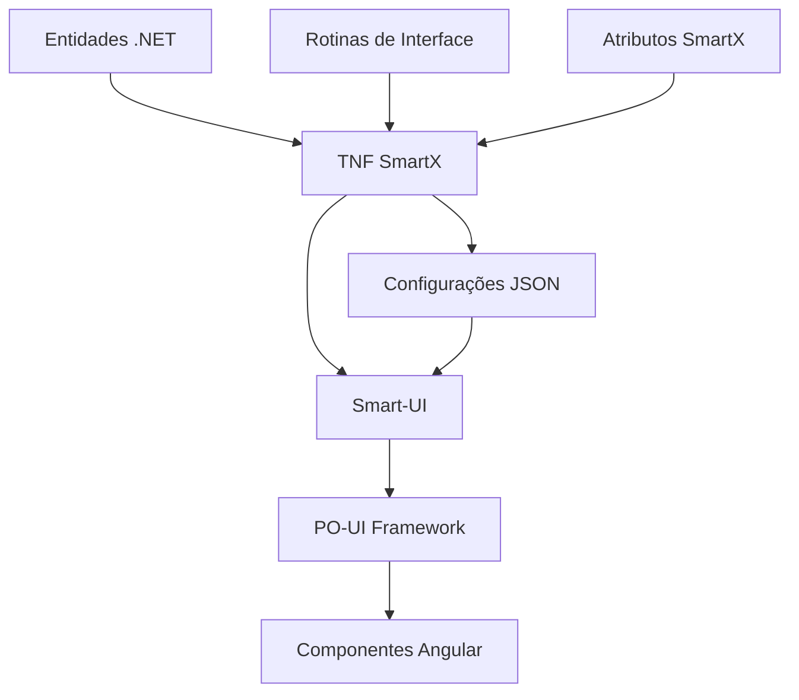
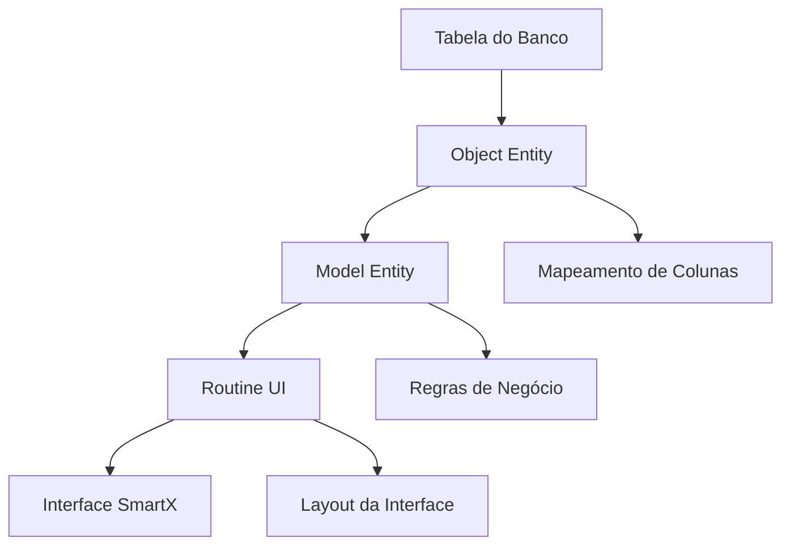

# 🚀 TNF SmartX - Geração Automática de Interfaces

Este projeto demonstra como usar o **TNF SmartX** para criar aplicações web dinâmicas com geração automática de interfaces baseadas em modelos de dados, utilizando componentes Smart-UI sobre o framework PO-UI da TOTVS.

> **📝 Nota Importante**: O TNF SmartX atualmente suporta **apenas PostgreSQL** como banco de dados. Todos os exemplos de código e configurações são específicos para PostgreSQL.

## 📋 Sumário

1. [Visão Geral](#-visão-geral)
2. [O que é o SmartX](#-o-que-é-o-smartx)
3. [Relacionamento com Smart-UI e PO-UI](#-relacionamento-com-smart-ui-e-po-ui)
4. [Pré-requisitos](#-pré-requisitos)
5. [Configuração Inicial](#-configuração-inicial)
6. [Configuração do Program.cs](#-configuração-do-programcs)
7. [Abordagem CodeFirst](#-abordagem-codefirst)
8. [Abordagem DatabaseFirst](#-abordagem-databasefirst)
9. [Configuração de Rotinas de Interface](#-configuração-de-rotinas-de-interface)
10. [Configuração de Eventos](#-configuração-de-eventos)
11. [Configuração de Relações](#-configuração-de-relações)
12. [Configuração de Validações](#-configuração-de-validações)
13. [Executando o Projeto](#-executando-o-projeto)
14. [Estrutura de Endpoints](#-estrutura-de-endpoints-automáticos)
15. [Comparação de Abordagens](#-principais-diferenças-entre-as-abordagens)

## 🎯 Visão Geral

O **TNF SmartX** é uma ferramenta poderosa desenvolvida pela TOTVS que permite criar aplicações web dinâmicas através de:

- **📊 Modelos de Dados**: Definição declarativa de entidades com configurações específicas
- **🖥️ Rotinas de Interface**: Geração automática de telas (listagem, inclusão, edição, detalhamento)
- **⚡ Eventos**: Configuração de ações e validações interativas
- **🔗 Relações**: Mapeamento inteligente de relacionamentos entre entidades
- **✅ Validações**: Regras de negócio e validações automáticas
- **🎨 Interfaces Responsivas**: Componentes baseados no PO-UI para experiência consistente

## 🔧 O que é o SmartX?

O SmartX é uma camada de abstração que permite aos desenvolvedores criar interfaces de usuário complexas de forma declarativa, utilizando atributos e configurações em suas entidades e rotinas. A ferramenta então gera automaticamente as configurações JSON necessárias para renderizar essas interfaces usando componentes do Smart-UI.

### Principais Benefícios:

- ⚡ **Desenvolvimento Rápido**: Reduz drasticamente o tempo de desenvolvimento de interfaces
- 🎯 **Padronização**: Garante consistência visual e funcional entre diferentes telas
- 🔄 **Manutenibilidade**: Mudanças no modelo refletem automaticamente na interface
- 📱 **Responsividade**: Interfaces adaptáveis para diferentes dispositivos
- 🛡️ **Validações Automáticas**: Regras de negócio aplicadas automaticamente

## 🔗 Relacionamento com Smart-UI e PO-UI



- **🎨 PO-UI**: Framework de componentes Angular da TOTVS que fornece uma biblioteca rica de componentes de interface
- **⚙️ Smart-UI**: Camada de abstração sobre o PO-UI que facilita a criação de interfaces através de configurações JSON
- **🚀 TNF SmartX**: Ferramenta que gera automaticamente as configurações Smart-UI a partir de definições de código .NET

## 🛠️ Pré-requisitos

Antes de executar este projeto, certifique-se de ter:

1. **📦 .NET 8.0 SDK** ou superior
2. **🐘 PostgreSQL** (versão 12 ou superior) instalado e em execução
3. **🔧 Visual Studio 2022** ou **Visual Studio Code** com extensões C#
4. **🐳 Docker** (opcional, para execução em containers)

### Verificação do PostgreSQL

```bash
# Verificar se o PostgreSQL está instalado e rodando
pg_isready -h localhost -p 5432

# Verificar versão (deve ser 12.0 ou superior)
psql --version

# Testar conexão com o PostgreSQL
psql -h localhost -U postgres -c "SELECT version();"
```

## ⚙️ Configuração e Setup do Projeto

### 1. Clonar e Configurar o Projeto

```bash
# Clonar o repositório
git clone https://github.com/totvs/tnf-samples.git
cd tnf-samples/Scenarios/SmartX

# Restaurar dependências
dotnet restore
```

### 2. Configurar Connection Strings

Edite o arquivo `src/Tnf.SmartX/appsettings.Development.json` com suas credenciais:

```json
{
    "ConnectionStrings": {
        "CodeFirst": "Host=localhost;User Id=postgres;Password=sua_senha;Database=SmartXCompany",
        "CodeFirstCustomer": "Host=localhost;User Id=postgres;Password=sua_senha;Database=SmartXCustomer",
        "DatabaseFirst": "Server=localhost;Port=5432;Database=SmartxDbFirst;User Id=postgres;Password=sua_senha"
    }
}
```

### 3. Executar o Migrator (PRIMEIRO PASSO OBRIGATÓRIO)

⚠️ **IMPORTANTE**: O projeto Migrator deve ser executado PRIMEIRO para criar os bancos de dados e aplicar as migrações.

```bash
# Navegar para o projeto Migrator
cd src/Tnf.SmartX.EntityFramework.Migrator

# Executar o migrator para criar bancos e aplicar migrações
dotnet run

# Aguardar a mensagem: "Database migrations completed!"
```

O Migrator irá:
- ✅ Criar automaticamente os bancos de dados se não existirem
- ✅ Aplicar todas as migrações do Entity Framework
- ✅ Configurar as tabelas e estruturas necessárias
- ✅ Preparar o ambiente para execução da aplicação

### 4. Verificar Criação dos Bancos (APÓS o Migrator)

Após executar o Migrator com sucesso, você pode verificar se os bancos foram criados:

```sql
-- Conectar ao PostgreSQL
psql -h localhost -U postgres

-- Listar todos os bancos de dados
\l

-- Verificar se os bancos do SmartX foram criados
\l SmartX*

-- Conectar a um dos bancos para verificar as tabelas
\c "SmartXCompany"
\dt

-- Sair do psql
\q
```

### 5. Executar a Aplicação Principal

```bash
# Voltar para o diretório da aplicação principal
cd ../Tnf.SmartX

# Executar a aplicação
dotnet run
```

### 3. Principais Dependências

O projeto utiliza os seguintes pacotes NuGet principais:

```xml
<!-- Tnf.SmartX.Sample.csproj -->
<PackageReference Include="Tnf.SmartX" Version="8.1.0.18102" />
<PackageReference Include="Tnf.SmartX.EntityFrameworkCore" Version="8.1.0.18102" />
<PackageReference Include="Tnf.AspNetCore" Version="8.1.0.18102" />
<PackageReference Include="Tnf.AspNetCore.Security.FluigIdentity" Version="8.1.0.18102" />

<!-- Dependência específica para PostgreSQL -->
<PackageReference Include="Npgsql.EntityFrameworkCore.PostgreSQL" Version="8.0.11" />

<!-- Swagger para documentação da API -->
<PackageReference Include="Swashbuckle.AspNetCore" Version="8.1.4" />
```

### 4. Banco de Dados Suportado

O **TNF SmartX** atualmente suporta **apenas PostgreSQL** como banco de dados:

| Componente | Versão Recomendada | Descrição |
|------------|-------------------|-----------|
| **PostgreSQL** | 12.0 ou superior | Banco de dados principal |
| **Npgsql.EntityFrameworkCore.PostgreSQL** | 8.0.11 | Provider do Entity Framework |

> **⚠️ Importante**: O TNF SmartX foi desenvolvido especificamente para PostgreSQL e não suporta outros bancos de dados no momento. Todas as funcionalidades, tipos de dados e configurações são otimizadas para PostgreSQL.

### Recursos PostgreSQL Utilizados:

- **🔧 Tipos de Dados Específicos**: JSONB, Arrays, UUID
- **📊 Funções Avançadas**: Agregações, window functions
- **🔍 Índices Especializados**: GIN, GiST para busca textual
- **🔒 Constraints Avançadas**: Check constraints, exclusion constraints
- **⚡ Performance**: Otimizações específicas do PostgreSQL

### 6. Configuração Completa do appsettings.Development.json

O arquivo de configuração completo deve incluir connection strings e configurações de autenticação:

```json
{
    "ConnectionStrings": {
        // CodeFirst: Banco para entidades criadas via Entity Framework
        "CodeFirst": "Host=localhost;User Id=postgres;Password=sua_senha;Database=SmartXCompany",

        // CodeFirstCustomer: Banco separado para entidades de Customer (multi-tenant)
        "CodeFirstCustomer": "Host=localhost;User Id=postgres;Password=sua_senha;Database=SmartXCustomer",

        // DatabaseFirst: Banco existente para mapeamento de tabelas legadas
        "DatabaseFirst": "Server=localhost;Port=5432;Database=SmartxDbFirst;User Id=postgres;Password=sua_senha"
    },

    // Configurações de autenticação TOTVS (opcional)
    "AuthorityEndpoint": "https://admin.rac.dev.totvs.app/totvs.rac",
    "ClientId": "link_service_data_upstreaming_cc",
    "ClientSecret": "totvs@123",

    "FluigIdentity": {
        "TokenEndpoint": "https://app.fluigidentity.net/accounts/oauth/token",
        "JwksEndpoint": "https://app.fluigidentity.net/accounts/api/v1/jwks"
    },

    // Configurações de logging
    "Serilog": {
        "MinimumLevel": {
            "Default": "Debug"
        },
        "WriteTo": [
            {
                "Name": "Console"
            }
        ]
    }
}
```

> **📋 Parâmetros da Connection String PostgreSQL:**
> - `Host`: Endereço do servidor PostgreSQL (ex: localhost, 192.168.1.100)
> - `Port`: Porta do servidor (padrão: 5432)
> - `User Id`: Nome do usuário do banco de dados
> - `Password`: Senha do usuário
> - `Database`: Nome do banco de dados
> - `Pooling`: Habilita pool de conexões (padrão: true)
> - `CommandTimeout`: Timeout para comandos em segundos (padrão: 30)
> - `MaxPoolSize`: Tamanho máximo do pool de conexões (padrão: 100)

### 7. Estrutura do Projeto e Fluxo de Execução

```
src/
├── Tnf.SmartX.EntityFramework.Migrator/ # 🔄 EXECUTAR PRIMEIRO - Migração de banco
│   ├── Program.cs                       # ⚡ Aplicação que cria bancos e migrações
│   ├── MigrationHostedService.cs        # Serviço de migração automática
│   └── appsettings.Development.json     # Connection strings para migração
│
├── Tnf.SmartX/                          # 🌐 Aplicação Web API principal (EXECUTAR SEGUNDO)
│   ├── Program.cs                       # Configuração da aplicação
│   ├── appsettings.json                 # Configurações gerais
│   └── appsettings.Development.json     # Configurações de desenvolvimento
│
├── Tnf.SmartX.Domain/                   # 📊 Camada de domínio
│   ├── CodeFirst/                       # Entidades Code-First
│   │   ├── Entities/                    # Classes de entidade
│   │   └── Routines/                    # Rotinas de interface
│   └── DatabaseFirst/                   # Entidades Database-First
│       └── Usuario/                     # Exemplo de módulo
│           ├── Entities/                # Objects (mapeamento de tabelas)
│           ├── Models/                  # Models (regras de negócio)
│           └── Routines/                # Rotinas de interface
│
├── Tnf.SmartX.EntityFrameworkCore/      # 🗄️ Configurações do EF Core
│   └── Configurations/                  # Configurações de entidades
│
└── Tnf.SmartX.EntityFramework.PostgreSql/ # 🐘 Implementação PostgreSQL
    └── PostgreSqlServiceCollectionExtensions.cs
```

### 🔄 Ordem de Execução Obrigatória:

1. **🔄 Migrator** (`Tnf.SmartX.EntityFramework.Migrator`) - Cria bancos e aplica migrações
2. **🌐 API Principal** (`Tnf.SmartX`) - Aplicação web com endpoints SmartX

> **⚠️ IMPORTANTE**: O Migrator deve sempre ser executado primeiro, pois ele é responsável por criar os bancos de dados e aplicar todas as migrações necessárias.

## 🔧 Configuração do Program.cs

O arquivo `Program.cs` é o ponto de entrada da aplicação e configura todos os serviços necessários:

```csharp
using Microsoft.EntityFrameworkCore;
using Tnf.SmartX;
using Tnf.SmartX.EntityFramework.PostgreSql;
using Tnf.SmartX.Sample.Swagger;

const string CodeFirstConnectionStringName = "CodeFirst";
const string DatabaseFirstConnectionStringName = "DatabaseFirst";

var builder = WebApplication.CreateBuilder(args);

// 🏗️ Configuração básica do TNF
builder.Services.AddTnfAspNetCore(b =>
{
    b.ApplicationName("TNF SmartX Sample");
    b.DefaultConnectionString(builder.Configuration.GetConnectionString(CodeFirstConnectionStringName));
    b.MultiTenancy(c => c.IsEnabled = true); // Habilita multi-tenancy
});

// 🔐 Configuração de segurança (Fluig Identity)
builder.Services.AddFluigIdentitySecurity(builder.Configuration);

// 🎛️ Configuração de controllers e CORS
builder.Services.AddControllers();
builder.Services.AddCorsAll("AllowAll");

// 📝 Configuração de versionamento de API
builder.Services.AddSmartXApiVersioning();

// 🗄️ Configuração dos DbContexts para PostgreSQL
builder.Services.AddEFCorePostgreSql(builder.Configuration);

// 🚀 Configuração principal do SmartX
builder.Services.AddTnfSmartX(b =>
{
    // Configurar Code-First (entidades criadas via EF)
    b.ConfigureEfCodeFirst();

    // Configurar Database-First (tabelas existentes)
    b.ConfigureEfDatabaseFirst(configure =>
        configure.UseNpgsql(builder.Configuration.GetConnectionString(DatabaseFirstConnectionStringName)));
});

var app = builder.Build();

// 🌐 Configuração do pipeline de requisições
app.UseCors("AllowAll");
app.UseRouting();

// 📚 Swagger apenas em desenvolvimento
if (app.Environment.IsDevelopment())
{
    app.UseSwagger();
    app.UseSwaggerUI();
}

// 🔐 Middleware de segurança
app.UseTnfAspNetCoreSecurity();

// 💓 Health checks
app.MapTnfHealthChecks();

// 🔗 HTTPS redirection
app.UseHttpsRedirection();

// 🎯 Mapeamento automático dos controllers do SmartX
app.MapTnfSmartXControllers();

app.Run();
```

### Principais Configurações:

- **🏗️ TNF AspNetCore**: Configuração base do framework TNF
- **🔐 Fluig Identity**: Sistema de autenticação da TOTVS
- **🗄️ Entity Framework**: Configuração para PostgreSQL
- **🚀 SmartX**: Configuração principal para geração de interfaces
- **📝 API Versioning**: Suporte a versionamento de APIs
- **💓 Health Checks**: Monitoramento de saúde da aplicação

## 📊 Abordagem CodeFirst

A abordagem **Code-First** é ideal para **projetos novos** onde você tem controle total sobre o schema do banco de dados. As entidades são definidas como classes C# e o Entity Framework gera automaticamente as tabelas.

### 🎯 Quando Usar Code-First:
- ✅ Projetos novos sem banco de dados existente
- ✅ Controle total sobre o schema
- ✅ Uso de migrations automáticas
- ✅ Desenvolvimento ágil com convenções

### 1. 📝 Definição da Entidade

```csharp
// CodeFirst/Entities/CompanyEntity.cs
using Tnf.Repositories.Entities;
using Tnf.Repositories.Entities.Auditing;

namespace Tnf.SmartX.Domain.CodeFirst.Entities;

/// <summary>
/// Entidade que representa uma empresa no sistema
/// Implementa interfaces para multi-tenancy e auditoria
/// </summary>
public class CompanyEntity : SXObject, IMustHaveTenant, IHasModificationTime, IHasCreationTime
{
    /// <summary>
    /// Identificador único da empresa
    /// </summary>
    public Guid Id { get; set; }

    /// <summary>
    /// ID do tenant (multi-tenancy)
    /// </summary>
    public Guid TenantId { get; set; }

    /// <summary>
    /// Nome da empresa
    /// </summary>
    public string Name { get; set; }

    /// <summary>
    /// Nome fantasia
    /// </summary>
    public string TradeName { get; set; }

    /// <summary>
    /// CNPJ da empresa
    /// </summary>
    public string RegistrationNumber { get; set; }

    /// <summary>
    /// Indica se a empresa possui ESG
    /// </summary>
    public bool HasEsg { get; set; }

    /// <summary>
    /// Email da empresa
    /// </summary>
    public string Email { get; set; }

    /// <summary>
    /// Data de criação (auditoria)
    /// </summary>
    public DateTime CreationTime { get; set; }

    /// <summary>
    /// Data da última modificação (auditoria)
    /// </summary>
    public DateTime? LastModificationTime { get; set; }

    /// <summary>
    /// Lista de departamentos da empresa (relacionamento 1:N)
    /// </summary>
    public List<DepartmentEntity> Departments { get; set; } = [];
}
```

### 🔧 Interfaces Implementadas:

- **`SXObject`**: Classe base para objetos SmartX
- **`IMustHaveTenant`**: Implementa multi-tenancy obrigatório
- **`IHasModificationTime`**: Adiciona auditoria de modificação
- **`IHasCreationTime`**: Adiciona auditoria de criação

### 2. 🗄️ Configuração do DbContext

O DbContext é responsável por gerenciar as entidades e suas configurações no Entity Framework:

```csharp
// EntityFramework/CompanyDbContext.cs
using Microsoft.EntityFrameworkCore;
using Tnf.EntityFrameworkCore;
using Tnf.Runtime.Session;
using Tnf.SmartX.Domain.CodeFirst.Entities;

namespace Microsoft.EntityFrameworkCore;

/// <summary>
/// Contexto do Entity Framework para entidades de empresa
/// Herda de TnfDbContext para integração com o framework TNF
/// </summary>
public class CompanyDbContext(DbContextOptions options, ITnfSession session) : TnfDbContext(options, session)
{
    // 🏢 Entidades principais
    public DbSet<CompanyEntity> Companies { get; set; }
    public DbSet<DepartmentEntity> Departments { get; set; }
    public DbSet<EmployeeEntity> Employees { get; set; }
    public DbSet<TeamEntity> Teams { get; set; }

    /// <summary>
    /// Configuração do modelo de dados
    /// </summary>
    protected override void OnModelCreating(ModelBuilder modelBuilder)
    {
        base.OnModelCreating(modelBuilder);

        // 🔧 Aplicar configurações específicas de cada entidade
        modelBuilder.ApplyConfiguration(new CompanyEntityConfiguration());
        modelBuilder.ApplyConfiguration(new DepartmentEntityConfiguration());
        modelBuilder.ApplyConfiguration(new EmployeeEntityConfiguration());
        modelBuilder.ApplyConfiguration(new TeamEntityConfiguration());

        // 🐘 Configurações específicas do PostgreSQL
        modelBuilder.HasDefaultSchema("public");

        // 📝 Configurar naming conventions para PostgreSQL (snake_case)
        foreach (var entity in modelBuilder.Model.GetEntityTypes())
        {
            // Converter nomes de tabelas para minúsculo
            entity.SetTableName(entity.GetTableName()?.ToLowerInvariant());

            // Converter nomes de colunas para minúsculo
            foreach (var property in entity.GetProperties())
            {
                property.SetColumnName(property.GetColumnName()?.ToLowerInvariant());
            }
        }
    }
}
```

### 🔧 Recursos do TnfDbContext:

- **🔐 Multi-tenancy**: Filtragem automática por tenant
- **📝 Auditoria**: Preenchimento automático de campos de auditoria
- **🗑️ Soft Delete**: Exclusão lógica de registros
- **📊 Session Management**: Integração com sessão do usuário

### 3. 🎨 Configuração SmartX (Entity Configuration)

Para Code-First, as configurações SmartX são feitas através do Entity Framework Configuration:

```csharp
// EntityFrameworkCore/Configurations/CompanyEntityConfiguration.cs
using Microsoft.EntityFrameworkCore;
using Microsoft.EntityFrameworkCore.Metadata.Builders;
using Tnf.SmartX.Domain.CodeFirst.Entities;
using Tnf.SmartX.EntityFrameworkCore;

namespace Tnf.SmartX.EntityFramework.Configurations;

/// <summary>
/// Configuração da entidade Company para SmartX
/// Implementa ISXEntityConfiguration para integração com SmartX
/// </summary>
public class CompanyEntityConfiguration : IEntityTypeConfiguration<CompanyEntity>, ISXEntityConfiguration
{
    public void Configure(EntityTypeBuilder<CompanyEntity> builder)
    {
        // 🗄️ Configuração da tabela
        builder.ToTable("Companies");
        builder.SxObjectDescription("Cadastro de Empresas");

        // 🔑 Chave primária
        builder.HasKey(e => e.Id);

        // 🏢 Propriedades com configurações SmartX
        builder.Property(e => e.Name)
            .IsRequired()
            .HasMaxLength(50)
            .SxTitle("Nome da Empresa")
            .SxDescription("Nome da Empresa");

        builder.Property(e => e.TradeName)
            .HasMaxLength(50)
            .SxTitle("Nome Fantasia")
            .SxDescription("Nome Fantasia");

        builder.Property(e => e.RegistrationNumber)
            .HasMaxLength(50)
            .SxTitle("CNPJ")
            .SxDescription("CNPJ da empresa")
            .SxPattern(@"^\d{2}\.\d{3}\.\d{3}\/\d{4}-\d{2}$"); // Formato CNPJ

        builder.Property(e => e.Email)
            .SxTitle("E-mail da Empresa")
            .SxDescription("E-mail da Empresa")
            .SxPattern(@"[a-z0-9._%+-]+@[a-z0-9.-]+\.[a-z]{2,4}$"); // Validação email

        builder.Property(e => e.HasEsg)
            .SxTitle("Possui ESG")
            .SxDescription("Indica se a empresa possui práticas ESG")
            .SxBooleanLabelTrue("Sim")
            .SxBooleanLabelFalse("Não")
            .HasDefaultValue(false);

        // 🔒 Campos ocultos na interface
        builder.Property(e => e.Id).SxHidden();
        builder.Property(e => e.TenantId).SxHidden();
        builder.Property(e => e.CreationTime).SxHidden();
        builder.Property(e => e.LastModificationTime).SxHidden();

        // 🔍 Configuração de busca
        builder.SxFinder(nameof(CompanyEntity.Name), nameof(CompanyEntity.RegistrationNumber));

        // 🔗 Relacionamentos
        builder.HasMany(c => c.Departments)
            .WithOne()
            .HasForeignKey("CompanyId")
            .SxRelationTitle("Departamentos");
    }
}
```

### 🎯 Principais Atributos SmartX para Code-First:

- **`SxTitle`**: Define o título/label do campo na interface
- **`SxDescription`**: Adiciona descrição/tooltip
- **`SxPattern`**: Define validação por regex
- **`SxHidden`**: Oculta o campo na interface
- **`SxBooleanLabelTrue/False`**: Labels customizados para campos booleanos
- **`SxObjectDescription`**: Descrição da entidade
- **`SxFinder`**: Define campos para busca/filtro
- **`SxRelationTitle`**: Título para relacionamentos

## 🗄️ Abordagem DatabaseFirst

A abordagem **Database-First** é ideal para trabalhar com **sistemas legados** e **bancos de dados existentes**. Nesta abordagem, você mapeia suas tabelas existentes usando atributos específicos do SmartX, mantendo total compatibilidade com estruturas já estabelecidas.

### 🎯 Quando Usar Database-First:
- ✅ Sistemas legados com banco de dados existente
- ✅ DBAs dedicados gerenciando o schema
- ✅ Performance otimizada para consultas específicas
- ✅ Integração com stored procedures e views complexas
- ✅ Compatibilidade com sistemas existentes
- ✅ Requisitos específicos de banco de dados

### 🏗️ Arquitetura Database-First

A abordagem Database-First no SmartX utiliza uma separação clara de responsabilidades:



- **🗄️ Object**: Mapeamento direto da tabela (estrutura)
- **📊 Model**: Regras de negócio e configurações avançadas
- **🖥️ Routine**: Definição da interface do usuário

### 1. 🗄️ Definição do Objeto (Object)

O **Object** representa o mapeamento direto da tabela do banco de dados. É a camada mais próxima da estrutura física do banco:

```csharp
// DatabaseFirst/Usuario/Entities/UsuarioObjectEntity.cs
using Tnf.SmartX;

namespace Tnf.SmartX.Domain.DatabaseFirst.Usuario.Entities;

/// <summary>
/// Object que mapeia a tabela GUSUARIO do banco de dados
/// Representa a estrutura física da tabela
/// </summary>
[SxObject("GlbUsuarioObject", "GUSUARIO", "Cadastro de Usuários")]
[SXConstraint(Name = "pk_gusuario", Type = "primarykey", Columns = ["CODUSUARIO"])]
[SXConstraint(Name = "fk_gusuario_gacesso", Type = "foreignkey", Columns = ["CODACESSO"],
              ParentObjectName = "GACESSO", ParentColumns = ["CODACESSO"])]
[SxFinder([nameof(Usuario)])] // Campo usado para busca
public class UsuarioObjectEntity : SXObject
{
    /// <summary>
    /// Código do usuário - Chave primária
    /// </summary>
    [SxProperty(ColumnName = "CODUSUARIO", Title = "Código do usuário",
               Description = "Código único do usuário", Required = true, IsPrimaryKey = true, MaxLength = 20)]
    public string Usuario { get; set; }

    /// <summary>
    /// Nome completo do usuário
    /// </summary>
    [SxProperty(ColumnName = "NOME", Title = "Nome do usuário",
               Description = "Nome completo do usuário", Required = true, MaxLength = 100)]
    public string Nome { get; set; }

    /// <summary>
    /// Status do usuário (0=Inativo, 1=Ativo)
    /// </summary>
    [SxProperty(ColumnName = "STATUS", Title = "Status", Description = "Status do usuário")]
    [SxFixedValues([0, 1])] // Valores permitidos
    public int Status { get; set; }

    /// <summary>
    /// Data de início de validade do usuário
    /// </summary>
    [SxProperty(ColumnName = "DATAINICIO", Title = "Data Início", Description = "Data de início de validade")]
    public DateTime DataInicio { get; set; }

    /// <summary>
    /// Data de expiração do usuário (opcional)
    /// </summary>
    [SxProperty(ColumnName = "DATAEXPIRACAO", Title = "Data Expiração", Description = "Data de expiração")]
    public DateTime? DataExpiracao { get; set; }

    /// <summary>
    /// Senha do usuário (campo oculto na interface)
    /// </summary>
    [SxProperty(ColumnName = "SENHA", Title = "Senha", Description = "Senha do usuário", Hidden = true)]
    public string Senha { get; set; }

    /// <summary>
    /// Email do usuário com validação
    /// </summary>
    [SxProperty(ColumnName = "EMAIL", Title = "Email", Description = "Email do usuário",
               Pattern = @"[a-z0-9._%+-]+@[a-z0-9.-]+\.[a-z]{2,4}$")]
    public string Email { get; set; }

    /// <summary>
    /// Identificador interno do usuário (oculto)
    /// </summary>
    [SxProperty(ColumnName = "USERID", Title = "Identificador", Description = "ID interno", Hidden = true)]
    public string UserId { get; set; }

    /// <summary>
    /// Flag para ignorar autenticação LDAP
    /// </summary>
    [SxProperty(
        ColumnName = "IGNORARAUTENTICACAOLDAP",
        Title = "Ignorar autenticação LDAP",
        Description = "Indica se deve ignorar autenticação LDAP",
        DefaultValue = false,
        BooleanLabelTrue = "Sim",
        BooleanLabelFalse = "Não",
        Rules = [RuleFieldEnum.rboolean]
    )]
    public bool? IgnorarAutenticacaoLdap { get; set; } = false;

    /// <summary>
    /// Código de acesso (chave estrangeira)
    /// </summary>
    [SxProperty(ColumnName = "CODACESSO", Title = "Código de Acesso",
               Description = "Código do tipo de acesso", FieldType = FieldType.FKFieldProperty)]
    public string CodAcesso { get; set; }

    // 🔗 Navigation Properties (relacionamentos)

    /// <summary>
    /// Objeto de acesso relacionado
    /// </summary>
    [SxProperty(FieldType = FieldType.NavigationProperty)]
    public virtual GAcessoObjectEntity AcessoObject { get; set; }

    /// <summary>
    /// Lista de permissões do usuário
    /// </summary>
    [SxProperty(FieldType = FieldType.NavigationProperty)]
    public virtual ICollection<PermisObjectEntity> Permis { get; set; }
}
```

#### 🏷️ Principais Atributos do Object:

| Atributo | Descrição | Exemplo |
|----------|-----------|---------|
| **`[SxObject]`** | Define nome do objeto, tabela física e descrição | `[SxObject("UserObj", "USERS", "Usuários")]` |
| **`[SXConstraint]`** | Define constraints do banco (PK, FK, unique, check) | `[SXConstraint(Name = "pk_user", Type = "primarykey")]` |
| **`[SxFinder]`** | Define campos usados para busca/filtro | `[SxFinder([nameof(Nome), nameof(Email)])]` |
| **`[SxProperty]`** | Mapeia propriedades para colunas da tabela | `[SxProperty(ColumnName = "NOME", Title = "Nome")]` |
| **`[SxFixedValues]`** | Define valores fixos permitidos (enum-like) | `[SxFixedValues([0, 1, 2])]` |
| **`[SxOptionValues]`** | Define opções com descrições | `[SxOptionValues([0, 1], ["Inativo", "Ativo"])]` |

#### 🔧 Propriedades do SxProperty:

| Propriedade | Tipo | Descrição | Exemplo |
|-------------|------|-----------|---------|
| **`ColumnName`** | `string` | Nome da coluna no banco | `"CODUSUARIO"` |
| **`Title`** | `string` | Título exibido na interface | `"Código do Usuário"` |
| **`Description`** | `string` | Descrição/tooltip | `"Código único do usuário"` |
| **`Required`** | `bool` | Campo obrigatório | `true` |
| **`MaxLength`** | `int` | Tamanho máximo | `50` |
| **`Hidden`** | `bool` | Ocultar na interface | `true` |
| **`Pattern`** | `string` | Validação regex | `@"^\d{11}$"` |
| **`DefaultValue`** | `object` | Valor padrão | `false` |
| **`IsPrimaryKey`** | `bool` | É chave primária | `true` |
| **`FieldType`** | `FieldType` | Tipo do campo | `FieldType.FKFieldProperty` |
| **`BooleanLabelTrue`** | `string` | Label para true | `"Sim"` |
| **`BooleanLabelFalse`** | `string` | Label para false | `"Não"` |

#### 🔗 Tipos de FieldType:

- **`FKFieldProperty`**: Campo de chave estrangeira
- **`NavigationProperty`**: Propriedade de navegação (relacionamento)
- **`CalculatedField`**: Campo calculado
- **`VirtualField`**: Campo virtual (não existe no banco)

### 2. 📊 Modelo de Negócio (Model)

O **Model** herda do Object e adiciona **regras de negócio**, **relações** e **configurações avançadas**. É onde você implementa a lógica específica da aplicação:

```csharp
// DatabaseFirst/Usuario/Models/UsuarioModelEntity.cs
using Tnf.SmartX;
using Tnf.SmartX.Domain.DatabaseFirst.Usuario.Entities;

namespace Tnf.SmartX.Domain.DatabaseFirst.Usuario.Models;

/// <summary>
/// Model que herda do Object e adiciona regras de negócio
/// Implementa ISXModel para integração com SmartX
/// </summary>
[SxModel(ModelName = "GlbUsuarioModel", Description = "Usuários")]
public class UsuarioModelEntity : UsuarioObjectEntity, ISXModel
{
    /// <summary>
    /// Lista de permissões do usuário (Relacionamento 1:N)
    /// Configurado com SxRelation para definir o relacionamento
    /// </summary>
    [SxRelation(Name = "fk_GUsuario_GPermis", Title = "Permissões",
               Columns = ["CODUSUARIO"], ParentColumns = ["CODUSUARIO"])]
    public List<PermisObjectEntity> Permis { get; set; } = [];

    /// <summary>
    /// Lista de perfis do usuário (Relacionamento 1:N)
    /// </summary>
    [SxRelation(Name = "fk_GUsuario_GUsrPerfil", Title = "Perfis",
               Columns = ["CODUSUARIO"], ParentColumns = ["CODUSUARIO"])]
    public List<UsuarioPerfilObjectEntity> Perfis { get; set; } = [];

    /// <summary>
    /// Configuração do modelo de negócio
    /// </summary>
    protected override void DoConfigure(IConfigurationModelBuilder builder)
    {
        base.DoConfigure(builder);

        // Configuração de propriedades filho em relações
        builder.SetProperty(p => p.WithProperty(nameof(Permis))
            .SetChildProperty(c =>
                c.WithProperty(nameof(PermisObjectEntity.Supervisor))
                    .WithOptionValues([
                        new OptionResult { Value = 1, Description = "Yes" },
                        new OptionResult { Value = 0, Description = "No" }
                    ])));

        // Configuração de Lookup (campo de busca)
        builder.SetProperty(p => p
            .WithProperty("codAcesso")
            .AddLookup(l => l
                .WithModelRef("GlbAcessoModel")
                .WithDisplayFields(["descricao"])
                .WithFieldValue("codAcesso")
                .WithLookupFinder(new FinderResult(["codAcesso"]))));

        // Configuração de valores de opção
        builder.SetProperty(p => p.WithProperty(nameof(Status))
            .WithOptionValues([
                new OptionResult { Value = 0, Description = "Inativo"},
                new OptionResult { Value = 1, Description = "Ativo" }
            ]));
    }

    /// <summary>
    /// Ações executadas antes de criar um registro
    /// </summary>
    protected override void DoBeforeCreate(BeforeCreateParams parms)
    {
        Senha = "1234561";
        Controle = 1;
        UserId = Usuario;
        
        // Configurar índices para relacionamentos
        if (Perfis != null)
        {
            var indice = 0;
            foreach (var perfil in Perfis)
            {
                perfil.Indice = indice++;
            }
        }
    }

    /// <summary>
    /// Validações customizadas
    /// </summary>
    protected override bool DoOnValidate(OnValidateParams parms)
    {
        // Exemplo de validação customizada
        if (string.IsNullOrEmpty(Usuario))
        {
            return false;
        }

        return OnValidate(parms);
    }
}
```

### 3. Exemplo de Objeto Relacionado (Permissões)

```csharp
// DatabaseFirst/Usuario/Entities/PermisObjectEntity.cs
using Tnf.SmartX;

namespace Tnf.SmartX.Domain.DatabaseFirst.Usuario.Entities;

[SxObject("GlbSegurancaPermisObject", "GPERMIS", "Cadastro de Permissões")]
[SXConstraint(Name = "pk_gperfil", Type = "primarykey", 
              Columns = ["CODCOLIGADA", "CODSISTEMA", "CODUSUARIO"])]
[SXConstraint(Name = "fk_gpermis_usuario", Type = "foreignkey", 
              Columns = ["CODUSUARIO"], ParentObjectName = "GUSUARIO", 
              ParentColumns = ["CODUSUARIO"])]
[SxFinder([nameof(CodColigada), nameof(CodSistema), nameof(CodUsuario)], '|', "{0}|{1}|{2}")]
public class PermisObjectEntity : SXObject
{
    [SxProperty(ColumnName = "CODCOLIGADA", Title = "Código da coligada", 
               Required = true, IsPrimaryKey = true)]
    public int CodColigada { get; set; }

    [SxProperty(ColumnName = "CODSISTEMA", Title = "Cód.Sistema", MaxLength = 1,
               Required = true, IsPrimaryKey = true)]
    [SxFixedValues(["0", "A", "B", "C", "D", "E", "F", "G", "H", "I", "K", "L", "M", 
                   "N", "O", "P", "R", "S", "T", "U", "V", "W", "X", "Y"])]
    public string CodSistema { get; set; }

    [SxProperty(ColumnName = "CODUSUARIO", Title = "Código do usuario", 
               FieldType = FieldType.FKFieldProperty, MaxLength = 20)]
    public string CodUsuario { get; set; }

    [SxProperty(ColumnName = "SUPERVISOR", Title = "Supervisor", Description = "Supervisor")]
    [SxOptionValues([0, 1], typeof(string), ["No", "Yes"])]
    public int Supervisor { get; set; }

    // Navigation Property
    [SxProperty(FieldType = FieldType.NavigationProperty)]
    public UsuarioObjectEntity Usuario { get; set; }
}
```

### 4. Principais Diferenças: Object vs Model

| Aspecto | **Object** | **Model** |
|---------|------------|-----------|
| **Propósito** | Mapear tabela do banco | Regras de negócio e interface |
| **Herança** | `SXObject` | `Object + ISXModel` |
| **Atributos** | `[SxObject]`, `[SxProperty]` | `[SxModel]`, `[SxRelation]` |
| **Responsabilidade** | Estrutura de dados | Configurações avançadas |
| **Validações** | Básicas (atributos) | Customizadas (métodos) |
| **Relacionamentos** | Navigation Properties | SxRelation com configurações |
| **Eventos** | Não suporta | Lifecycle completo |

### 5. Configurações Avançadas do DatabaseFirst

#### Constraints e Índices
```csharp
[SXConstraint(Name = "pk_usuario", Type = "primarykey", Columns = ["CODUSUARIO"])]
[SXConstraint(Name = "fk_usuario_acesso", Type = "foreignkey", 
              Columns = ["CODACESSO"], ParentObjectName = "GACESSO", 
              ParentColumns = ["CODACESSO"])]
[SXConstraint(Name = "uk_usuario_email", Type = "unique", Columns = ["EMAIL"])]
[SXConstraint(Name = "chk_usuario_status", Type = "check", CheckCondition = "STATUS IN (0,1)")]
```

#### Tipos de Dados Específicos
```csharp
[SxProperty(ColumnName = "DATA", Title = "Data", DataType = typeof(DateTime))]
public DateTime Data { get; set; }

[SxProperty(ColumnName = "VALOR", Title = "Valor", DataType = typeof(decimal), 
           Precision = 15, Scale = 2)]
public decimal Valor { get; set; }

[SxProperty(ColumnName = "DESCRICAO", Title = "Descrição", MaxLength = 200)]
public string Descricao { get; set; }
```

#### Finders Customizados
```csharp
// Finder simples
[SxFinder([nameof(Usuario)])]

// Finder composto com separador
[SxFinder([nameof(CodColigada), nameof(CodSistema), nameof(CodUsuario)], '|', "{0}|{1}|{2}")]

// Finder com formato customizado
[SxFinder([nameof(Ano), nameof(Mes)], '/', "{0:0000}/{1:00}")]
```

## Configuração de Rotinas de Interface

### Rotina Dinâmica

```csharp
// DatabaseFirst/Usuario/Routines/UsuarioRoutineUI.cs
using Tnf.SmartX;
using Tnf.SmartX.Domain.DatabaseFirst.Usuario.Models;

namespace Tnf.SmartX.Domain.DatabaseFirst.Usuario.Routines;

[SxRoutine(RoutineName = "GlbUsuarioRoutine", Title = "UserRoutine", Version = "1.0")]
public class UsuarioRoutineUI : UsuarioModelEntity, ISXRoutineLayoutDataOperations
{
    public void ConfigureLayout(IRoutineLayoutDataOperationsBuilder builder)
    {
        builder
            .AddDataView(x => x
                .WithIdentifier("dataViewUsers")
                .WithTitle("Listagem de Usuários")
                .WithIndex(true)
                .AddTable(e => e
                    .WithIdentifier("tableUsers")
                    .SetColumn(c => c.WithProperty(nameof(Usuario)))
                    .SetColumn(c => c.WithProperty(nameof(Nome)))
                    .SetColumn(c => c.WithProperty(nameof(Email)))
                    .SetFilter(f => f.WithProperty(nameof(Usuario))
                        .WithBasicOperator(FilterOperatorEnum.Equal, false))
                )
            )
            .AddDataNew(v => v
                .WithIdentifier("dataNewUser")
                .WithTitle("Novo Usuário")
                .AddTabs(t => t
                    .AddTab(tab => tab
                        .WithIdentifier("tabUser")
                        .WithTitle("Usuário")
                        .WithOrder(1)
                        .AddSection(s => s
                            .WithIdentifier("sectionDataUser")
                            .WithTitle("Dados do Usuário")
                            .AddElement(e => e.WithProperty(nameof(Usuario)))
                            .AddElement(e => e.WithProperty(nameof(Nome)))
                            .AddElement(e => e.WithProperty(nameof(Email)))
                        )
                    )
                )
            )
            .AddDataDetail(v => v
                .WithIdentifier("dataDetailUser")
                .WithTitle("Detalhes do Usuário")
                // Configuração similar ao DataNew
            )
            .AddDataEdit(v => v
                .WithIdentifier("dataEditUser")
                .WithTitle("Editar Usuário")
                // Configuração similar ao DataNew
            );
    }
}
```

## Configuração de Eventos

### Eventos OnBlur e OnLoad

```csharp
builder.AddEvents(e => e
    // Evento OnBlur: disparado quando o usuário sai do campo
    .AddOnBlur(b => b
        .WithContext([RoutineLayoutEnum.DataNew, RoutineLayoutEnum.DataEdit])
        .WithFields([nameof(Usuario)]) // Campos que disparam o evento
        .AddAction(a => a
            .AddApiCallAction(ac => ac
                .WithIdentifier("apiCallVerifyUser")
                .WithMethod(ActionMethodEnum.GET)
                .WithEndpoint("data/GlbUsuarioModel/U099")
                .WithLabel("Verificar Usuário")
                // Ação em caso de sucesso
                .AddActionSuccess(acs => acs
                    .AddSetFieldsAction(sf => sf
                        .WithIdentifier("setFieldsEmail")
                        .WithLabel("Preencher Email")
                        .AddField(f => f
                            .SetProperty(p => p
                                .WithProperty(nameof(Email))
                                .WithReadOnly(true))
                            .WithValue("{{$response.email}}") // Usar resposta da API
                        )
                    )
                )
                // Ação em caso de erro
                .AddActionError(ace => ace
                    .AddShowMessageAction(sm => sm
                        .WithIdentifier("smEmailError")
                        .WithLabel("Erro na Verificação")
                        .WithMessage("Falha ao verificar o usuário!")
                        .WithSupportMessage("Verifique se o código do usuário está correto.")
                        .WithMessageType(ActionMessageTypeEnum.Error)
                    )
                )
            )
        )
    )
    
    // Evento OnLoad: disparado quando a tela é carregada
    .AddOnLoad(l => l
        .WithContext([RoutineLayoutEnum.DataView, RoutineLayoutEnum.DataNew])
        .WithFields([nameof(Usuario)]) // Opcional: especificar campos
        .AddAction(a => a
            .AddShowMessageAction(sm => sm
                .WithIdentifier("showMessageOnLoad")
                .WithLabel("Tela Carregada")
                .WithMessage("Tela de usuário carregada com sucesso!")
                .WithMessageType(ActionMessageTypeEnum.Info)
            )
        )
    )
);
```

## Configuração de Relações

### Relacionamentos 1:N (Um para Muitos)

```csharp
// Um usuário pode ter muitas permissões
[SxRelation(Name = "fk_GUsuario_GPermis", Title = "Permissões", 
           Columns = ["CODUSUARIO"], ParentColumns = ["CODUSUARIO"])]
public List<PermisObjectEntity> Permis { get; set; } = [];

// Um usuário pode ter muitos perfis
[SxRelation(Name = "fk_GUsuario_GUsrPerfil", Title = "Perfis", 
           Columns = ["CODUSUARIO"], ParentColumns = ["CODUSUARIO"])]
public List<UsuarioPerfilObjectEntity> Perfis { get; set; } = [];
```

### Relacionamentos N:1 (Muitos para Um)

```csharp
// Muitas permissões pertencem a um usuário
[SxProperty(FieldType = FieldType.NavigationProperty)]
public UsuarioObjectEntity Usuario { get; set; }

// Muitos usuários podem ter o mesmo tipo de acesso
[SxProperty(FieldType = FieldType.NavigationProperty)]
public virtual GAcessoObjectEntity AcessoObject { get; set; }
```

### Lookups

```csharp
builder.SetProperty(p => p
    .WithProperty("codAcesso")
    .AddLookup(l => l
        .WithModelRef("GlbAcessoModel")      // Modelo de referência
        .WithDisplayFields(["descricao"])    // Campo a ser exibido
        .WithFieldValue("codAcesso")         // Campo de valor
        .WithLookupFinder(new FinderResult(["codAcesso"])) // Campo de busca
    )
);
```

## Configuração de Validações

### Validações de Propriedades

```csharp
// Validação de email com pattern regex
builder.SetProperty(p => p
    .WithProperty(nameof(Email))
    .WithPattern("[a-z0-9._%+-]+@[a-z0-9.-]+\\.[a-z]{2,4}$")
    .WithRequired(true)
    .WithTitle("Email")
    .WithDescription("Email do usuário")
);

// Validação de campo obrigatório com tamanho máximo
builder.SetProperty(p => p
    .WithProperty(nameof(Usuario))
    .WithRequired(true)
    .WithMaxLength(20)
    .WithTitle("Código do Usuário")
);

// Validação de valores específicos (Status: Ativo/Inativo)
builder.SetProperty(p => p
    .WithProperty(nameof(Status))
    .WithRequired(true)
    .WithOptionValues([
        new OptionResult { Value = 0, Description = "Inativo"},
        new OptionResult { Value = 1, Description = "Ativo" }
    ])
);

// Campo booleano com labels customizados
[SxProperty(
    ColumnName = "IGNORARAUTENTICACAOLDAP",
    Title = "Ignorar autenticação",
    DefaultValue = false,
    BooleanLabelTrue = "Sim",
    BooleanLabelFalse = "Não",
    Rules = [RuleFieldEnum.rboolean]
)]
public bool? IgnorarAutenticacaoLdap { get; set; } = false;
```

### Validações Customizadas

```csharp
/// <summary>
/// Validações customizadas executadas antes de salvar
/// </summary>
protected override bool DoOnValidate(OnValidateParams parms)
{
    // Validação customizada: verificar se usuário está preenchido
    if (string.IsNullOrEmpty(Usuario))
    {
        // Adicionar erro de validação
        AddValidationError("Usuario", "Código do usuário é obrigatório");
        return false;
    }

    // Validação de email se preenchido
    if (!string.IsNullOrEmpty(Email) && !IsValidEmail(Email))
    {
        AddValidationError("Email", "Email inválido");
        return false;
    }

    // Validar se data de início não é futura
    if (DataInicio > DateTime.Now)
    {
        AddValidationError("DataInicio", "Data de início não pode ser futura");
        return false;
    }
    
    return OnValidate(parms);
}

private bool IsValidEmail(string email)
{
    var emailPattern = @"^[a-z0-9._%+-]+@[a-z0-9.-]+\.[a-z]{2,4}$";
    return System.Text.RegularExpressions.Regex.IsMatch(email, emailPattern);
}
```

### Ações Antes de Criar/Atualizar

```csharp
/// <summary>
/// Ações executadas antes de criar um novo registro
/// </summary>
protected override void DoBeforeCreate(BeforeCreateParams parms)
{
    // Definir valores padrão
    Senha = "1234561";
    Controle = 1;
    UserId = Usuario;
    DataInicio = DateTime.Now;
    
    // Configurar índices para relacionamentos filho
    if (Perfis != null)
    {
        var indice = 0;
        foreach (var perfil in Perfis)
        {
            perfil.Indice = indice++;
            perfil.CodUsuario = Usuario; // Garantir consistência
        }
    }
    
    // Configurar permissões padrão
    if (Permis != null)
    {
        foreach (var permissao in Permis)
        {
            permissao.CodUsuario = Usuario;
            if (permissao.CodColigada == 0)
                permissao.CodColigada = 1; // Valor padrão
        }
    }
}

/// <summary>
/// Ações executadas antes de atualizar um registro
/// </summary>
protected override void DoBeforeUpdate(BeforeUpdateParams parms)
{
    // Atualizar timestamp de modificação
    if (this is IHasModificationTime modifiable)
    {
        modifiable.LastModificationTime = DateTime.Now;
    }
    
    // Garantir consistência nos relacionamentos
    if (Perfis != null)
    {
        foreach (var perfil in Perfis)
        {
            perfil.CodUsuario = Usuario;
        }
    }
}

/// <summary>
/// Ações executadas após carregar um registro
/// </summary>
protected override void DoAfterLoad(AfterLoadParams parms)
{
    // Lógica após carregar o registro
    // Ex: carregar dados adicionais, calcular campos, etc.
    
    base.DoAfterLoad(parms);
}
```

## Configuração de Ações

### Ações de Página

```csharp
.AddPageAction(pa => pa
    .AddAction(a => a
        .AddNavigateAction(na => na
            .WithIdentifier("siteTotvs")
            .WithLabel("Totvs")
            .WithTarget(ActionTargetEnum.Blank)
            .WithUrl("https://totvs.com")
        )
    )
)
```

### Ações de Tabela

```csharp
.AddTableAction(ta => ta
    .WithMinSelectedItems(1)
    .WithMaxSelectedItems(3)
    .AddAction(a => a
        .AddShowMessageAction(r => r
            .WithIdentifier("tableNavNameUser")
            .WithLabel("Clique aqui!")
            .WithMessage("Olá! O nome do usuário selecionado é: {{$selectedRow.nome}}")
            .WithMessageType(ActionMessageTypeEnum.Info)
        )
    )
)
```

## Executando o Projeto

### 🚀 Fluxo de Execução Completo

Siga esta sequência exata para configurar e executar o projeto:

#### 1. Verificar Pré-requisitos

```bash
# Verificar se PostgreSQL está rodando
pg_isready -h localhost -p 5432

# Verificar versão do .NET
dotnet --version

# Verificar se consegue conectar no PostgreSQL
psql -h localhost -U postgres -c "SELECT version();"
```

#### 2. Configurar o Projeto

```bash
# Clonar e navegar para o projeto
git clone https://github.com/totvs/tnf-samples.git
cd tnf-samples/Scenarios/SmartX

# Restaurar dependências
dotnet restore

# Configurar connection strings no appsettings.Development.json
```

#### 3. Executar o Migrator (OBRIGATÓRIO PRIMEIRO)

```bash
# Navegar para o projeto Migrator
cd src/Tnf.SmartX.EntityFramework.Migrator

# Executar o migrator - ele criará os bancos automaticamente
dotnet run

# Aguardar mensagem de sucesso: "Database migrations completed!"
```

> **💡 O que o Migrator faz:**
> - Cria automaticamente os bancos de dados se não existirem
> - Aplica todas as migrações do Entity Framework
> - Configura tabelas, índices e constraints
> - Prepara o ambiente para a aplicação principal

#### 4. Verificar Criação dos Bancos (Opcional)

```bash
# Verificar se os bancos foram criados
psql -h localhost -U postgres -l | grep SmartX

# Ou conectar e verificar tabelas
psql -h localhost -U postgres -d "SmartXCompany" -c "\dt"
```

#### 5. Executar a Aplicação Principal

```bash
# Voltar para o diretório da aplicação
cd ../Tnf.SmartX

# Executar a aplicação
dotnet run

# A aplicação estará disponível em:
# - HTTP: http://localhost:5050
# - HTTPS: https://localhost:7021
# - Swagger: http://localhost:5050/swagger
```

### ⚠️ Troubleshooting

**Se o Migrator falhar:**
```bash
# Verificar se PostgreSQL está rodando
sudo systemctl status postgresql

# Verificar connection string no appsettings.Development.json
# Verificar se o usuário postgres tem permissões adequadas
```

**Se a aplicação não conectar:**
```bash
# Verificar se o Migrator foi executado com sucesso
# Verificar logs da aplicação para erros de conexão
# Confirmar que os bancos existem: psql -l | grep SmartX
```

### 4. Acessar a Aplicação

- **Swagger**: `https://localhost:7000/swagger`
- **API Base**: `https://localhost:7000/api`
- **Endpoints SmartX**: `https://localhost:7000/api/smartx`

## Estrutura de Endpoints Automáticos

O SmartX gera automaticamente os seguintes endpoints para cada modelo:

- `GET /api/smartx/data/{ModelName}` - Listagem
- `GET /api/smartx/data/{ModelName}/{id}` - Busca por ID
- `POST /api/smartx/data/{ModelName}` - Criação
- `PUT /api/smartx/data/{ModelName}/{id}` - Atualização
- `DELETE /api/smartx/data/{ModelName}/{id}` - Exclusão
- `GET /api/smartx/routine/{RoutineName}` - Configuração da rotina


## Principais Diferenças Entre as Abordagens

### CodeFirst
- Entidades definidas como classes C#
- Migrations automáticas do Entity Framework
- Configuração via Fluent API
- Ideal para projetos novos

### DatabaseFirst
- **Entidades mapeadas para tabelas existentes** (como GUSUARIO, GPERMIS)
- **Uso de atributos** para definir colunas (`[SxProperty]`, `[SxObject]`)
- **Configuração via atributos** (`SxProperty`, `SxObject`, `SxConstraint`)
- **Separation of Concerns**: Object (estrutura) + Model (negócio)
- **Ideal para sistemas legados** com bancos já estabelecidos
- **Controle total sobre constraints** e relacionamentos existentes
- **Suporte a stored procedures** e views complexas

## Observações Importantes

1. **Herança**: Todas as entidades devem herdar de `SXObject`
2. **Interfaces**: Models devem implementar `ISXModel`
3. **Rotinas**: Rotinas devem implementar `ISXRoutineLayoutDataOperations`
4. **Configuração**: Use `protected override void DoConfigure()` para configurações avançadas
5. **Eventos**: Configure eventos no método `ConfigureLayout()`

## 🐘 Configurações Específicas do PostgreSQL

O TNF SmartX foi desenvolvido especificamente para PostgreSQL, aproveitando recursos únicos deste banco:

### 📝 Naming Conventions
```csharp
// No OnModelCreating do DbContext, configurar convenções do PostgreSQL
protected override void OnModelCreating(ModelBuilder modelBuilder)
{
    // PostgreSQL utiliza snake_case por convenção
    modelBuilder.HasDefaultSchema("public");

    // Configurar nomes de tabelas e colunas em minúsculo
    foreach (var entity in modelBuilder.Model.GetEntityTypes())
    {
        entity.SetTableName(entity.GetTableName()?.ToLowerInvariant());

        foreach (var property in entity.GetProperties())
        {
            property.SetColumnName(property.GetColumnName()?.ToLowerInvariant());
        }
    }
}
```

### 🔧 Tipos de Dados PostgreSQL Específicos
```csharp
// Configurações específicas para tipos PostgreSQL
builder.Property(e => e.Id)
    .HasColumnType("uuid")
    .HasDefaultValueSql("gen_random_uuid()");

builder.Property(e => e.JsonData)
    .HasColumnType("jsonb"); // Tipo JSON binário do PostgreSQL

builder.Property(e => e.Tags)
    .HasColumnType("text[]"); // Array de strings

builder.Property(e => e.Metadata)
    .HasColumnType("hstore"); // Tipo chave-valor do PostgreSQL

builder.Property(e => e.SearchVector)
    .HasColumnType("tsvector"); // Busca textual full-text
```

### ⚡ Performance e Índices Especializados
```csharp
// Índices específicos do PostgreSQL
builder.HasIndex(e => e.Email)
    .IsUnique()
    .HasDatabaseName("idx_usuario_email");

// Índice GIN para busca em JSONB
builder.HasIndex(e => e.JsonData)
    .HasMethod("gin")
    .HasDatabaseName("idx_usuario_jsondata");

// Índice para busca textual
builder.HasIndex(e => e.SearchVector)
    .HasMethod("gin")
    .HasDatabaseName("idx_usuario_search");

// Índice composto
builder.HasIndex(e => new { e.CodColigada, e.IdMov })
    .HasDatabaseName("idx_notafiscal_coligada_id");
```

### 🔍 Recursos Avançados do PostgreSQL
```csharp
// Constraints específicas do PostgreSQL
builder.HasCheckConstraint("CK_Usuario_Status", "status IN (0, 1)");

// Exclusion constraint (único do PostgreSQL)
builder.HasIndex(e => new { e.PeriodoInicio, e.PeriodoFim })
    .HasMethod("gist")
    .HasOperators("&&") // Operador de sobreposição
    .IsUnique();

// Partial index (índice condicional)
builder.HasIndex(e => e.Email)
    .HasFilter("email IS NOT NULL")
    .HasDatabaseName("idx_usuario_email_not_null");
```

## 🎯 Quando Usar Cada Abordagem

### Use **CodeFirst** quando:
- ✅ Criar um **projeto novo** do zero
- ✅ Ter **controle total** sobre o schema do banco PostgreSQL
- ✅ Usar **migrations automáticas** do Entity Framework
- ✅ Trabalhar com **equipes de desenvolvimento ágeis**
- ✅ Priorizar **produtividade** e **convenções**
- ✅ Aproveitar **recursos modernos** do PostgreSQL (JSONB, arrays, etc.)

### Use **DatabaseFirst** quando:
- ✅ Trabalhar com **sistemas legados** existentes no PostgreSQL
- ✅ Ter **DBAs dedicados** gerenciando o schema
- ✅ Precisar de **performance otimizada** para consultas específicas
- ✅ Integrar com **stored procedures** e **views complexas** do PostgreSQL
- ✅ Manter **compatibilidade** com sistemas existentes
- ✅ Ter **requisitos específicos** de estruturas de dados PostgreSQL
- ✅ Usar **recursos avançados** como particionamento, índices especializados

### 💡 Exemplo Real no SmartX:
- **CodeFirst**: `CompanyEntity`, `DepartmentEntity` → Estruturas novas aproveitando recursos modernos do PostgreSQL
- **DatabaseFirst**: `UsuarioObjectEntity`, `PermisObjectEntity` → Tabelas de sistema já estabelecidas com estruturas específicas

### 🔧 Vantagens do PostgreSQL no SmartX:
- **🚀 Performance**: Otimizações específicas para PostgreSQL
- **📊 Tipos Avançados**: JSONB, arrays, UUID nativos
- **🔍 Busca Textual**: Full-text search integrado
- **🔒 Integridade**: Constraints avançadas e triggers
- **📈 Escalabilidade**: Recursos de particionamento e replicação

## 📚 Recursos Adicionais

### 📖 Documentação Oficial
- [TNF Framework Documentation](https://github.com/totvs/tnf)
- [PO-UI Components](https://po-ui.io/)
- [Entity Framework Core](https://docs.microsoft.com/en-us/ef/core/)
- [PostgreSQL Documentation](https://www.postgresql.org/docs/)

### 🎯 Exemplos Práticos
- **Code-First**: Ideal para novos projetos com controle total do schema
- **Database-First**: Perfeito para sistemas legados e bancos existentes
- **Hybrid Approach**: Combine ambas as abordagens conforme necessário

### 🔧 Ferramentas Recomendadas
- **Visual Studio 2022**: IDE principal para desenvolvimento .NET
- **pgAdmin**: Interface gráfica para PostgreSQL
- **Postman**: Teste de APIs REST
- **Docker**: Containerização da aplicação

### 🚀 Próximos Passos
1. **Explore os exemplos**: Execute o projeto e teste as funcionalidades
2. **Customize as entidades**: Adapte para suas necessidades específicas
3. **Implemente validações**: Adicione regras de negócio customizadas
4. **Integre com frontend**: Use as APIs geradas com aplicações Angular/PO-UI

